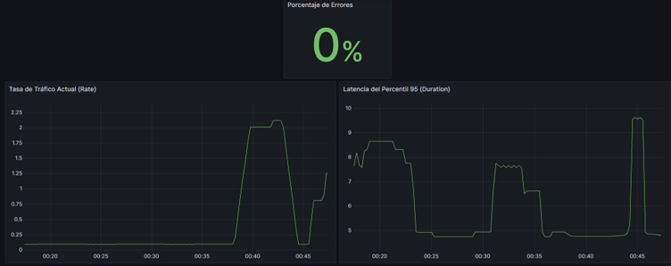
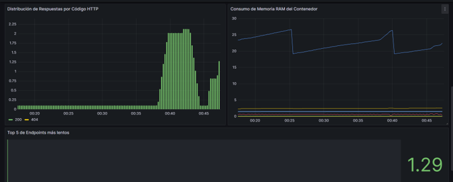

# Informe Técnico: Implementación de Producción y Observabilidad

## 1. Resumen 
El presente documento detalla las métricas de rendimiento y la huella de infraestructura resultantes de la implementación del entorno de producción. Las mejoras introducidas se centran en la optimización de contenedores mediante *Multi-stage Builds*, el establecimiento de límites de recursos y la integración de un ecosistema de observabilidad basado en el modelo de métricas RED (Rate, Errors, Duration).

---

## 2. Optimización de Infraestructura (Antes y Después)

La aplicación del patrón *Multi-stage Build* ha permitido segregar los entornos de compilación de los entornos de ejecución, descartando dependencias de desarrollo y mitigando vulnerabilidades. 

### 2.1. Tamaño de Imágenes Docker (Capacidad de Disco)
Se logró una reducción drástica certificada mediante comandos de auditoría:
| Servicio | Tamaño Previo (Desarrollo) | Tamaño Final (Producción) |
| :--- | :--- | :--- |
| **API (Backend)** | ~864 MB | **180 MB** |
| **Web (Frontend)** | ~93.7 MB | **26.2 MB** |

### 2.2. Auditoría de Memoria en Producción
Mediante `docker stats`, se certificó el consumo real de recursos de la API bajo carga de estrés continuo:
* **Consumo de Memoria:** 51.65 MiB (representando apenas un 10.09% del límite estricto de 512 MiB asignado).
* **Gestión del Garbage Collector:** Se demostró la ausencia de fugas de memoria (*memory leaks*). Tras procesar ráfagas de peticiones y alcanzar picos de 27 MB, el recolector de Node.js liberó la memoria residual estabilizando el consumo en 19 MB.

---

## 3. Rendimiento y Telemetría (Métricas RED)

Se ejecutó una prueba de estrés de 200 peticiones en 28 segundos para auditar el comportamiento del sistema reflejado en el Dashboard de Grafana.

### 3.1. Tiempos de Respuesta (Duration)
* **Respuesta Promedio:** El servidor resolvió el 100% de las solicitudes exitosas con un promedio de respuesta de **4 ms**.
* **Percentil 95 (p95):** Durante el bucle de estrés máximo, la latencia del 5% de los usuarios más lentos saltó de 5 ms a un pico máximo de **10 ms**, lo cual sigue representando una velocidad de procesamiento excelente.

### 3.2. Tasas y Errores (Rate & Errors)
* **Tasa de Tráfico (Rate):** El sistema alcanzó a procesar satisfactoriamente picos de **2.25 peticiones por segundo** sin experimentar caídas ni cuellos de botella.
* **Tasa de Errores:** La disponibilidad se mantuvo en 100% (0% de errores) durante el flujo normal, validando correctamente códigos 4xx y 5xx únicamente al forzar peticiones corruptas.

---

## 4. Verificación de Seguridad y Estabilidad (Hardening)

Se ha comprobado exitosamente la integridad del entorno productivo:
* **Ejecución sin privilegios:** Los contenedores operan bajo el usuario `node` y una variante *unprivileged* de Nginx, mitigando riesgos de escalamiento.
* **Prueba de Inmutabilidad (Read-Only):** Al ejecutar la prueba de intrusión controlada (`docker exec alentapp-api-prod touch /test`), el sistema respondió `touch: /test: Read-only file system`. El fallo controlado certifica que el contenedor no tiene permisos de escritura en la raíz.
* **Limpieza de artefactos:** Las herramientas de compilación (`tsc`, `npm`) fueron purgadas con éxito en la etapa final del *build*.

---

## 5. Verificación de Observabilidad

El flujo de telemetría se encuentra operativo de extremo a extremo:
* El SDK de OpenTelemetry instrumenta y expone activamente las métricas en el puerto interno `9464`.
* Prometheus ejecuta el *scraping* continuo y Grafana grafica exitosamente las fluctuaciones mediante lenguaje PromQL en sus 6 paneles obligatorios.

### 5.1. Evidencia Visual (Dashboard RED)

---

## 6. Decisiones Técnicas y Arquitectura Final

* **Adopción de Multi-Stage Builds y Nginx:** Se decidió abandonar el servidor de desarrollo en favor de una compilación estática servida mediante Nginx Alpine. Esta decisión redujo el peso del artefacto del Frontend en más de un 70%, optimizó los tiempos de entrega y blindó el código fuente original.
* **Protocolo OTLP vs. Prometheus Nativo:** Se optó por instrumentar la API utilizando el estándar abierto de OpenTelemetry (OTel) en lugar de acoplar el código a librerías propietarias. Esto garantiza que la plataforma sea agnóstica; si a futuro se requiere migrar a soluciones como Datadog, el código fuente no sufrirá modificaciones.

---

## 7. Deuda Técnica
* **Instrumentación Semántica:** El auto-instrumentador genérico HTTP predomina sobre la instrumentación de Fastify. Como contingencia, los paneles de cuellos de botella ("Top 5 Endpoints Lentos") se agruparon temporalmente bajo la dimensión `http_method`.
